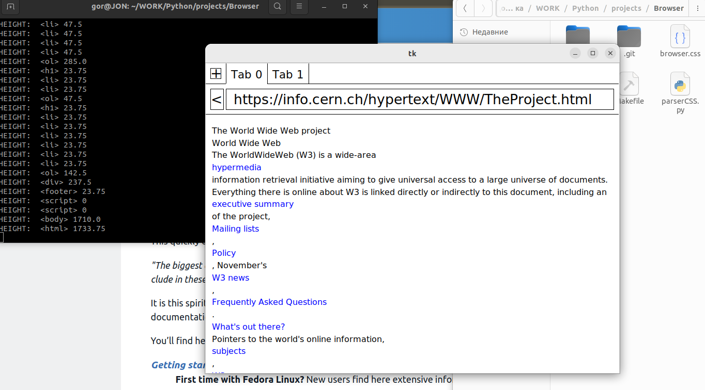

# Браузер

Браузер. Получает web-страницу из HTTP-запроса. Парсит HTML и CSS. Строит в памяти дерево элементов из тегов HTML. Отображает на экране элементы.

Написан на Python.

Статус проекта: Завершен.

2023 Evgeny Goryachev    
Gor.Com 

